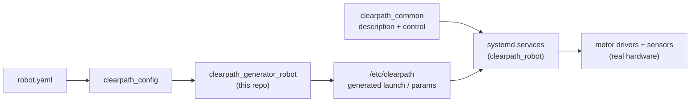

# clearpath_robot

ROS 2 packages for interfacing with Clearpath Platforms (real hardware).

For supported platforms, sensors and manipulators plus additional details, please see: <https://docs.clearpathrobotics.com/docs/ros/>

## Where this fits in the Clearpath ROS 2 stack

`clearpath_robot` is the **on-robot** half of the stack: it runs on the physical platform's
onboard computer, talks to the motor controllers and sensors, and brings the robot up as a set of
`systemd` services. It consumes the description/control assets from `clearpath_common` and the
files generated from `robot.yaml`.



## Packages

| Package | Description | Key files |
| --- | --- | --- |
| `clearpath_robot` | Metapackage. Bringup **scripts** and the `systemd` **services** that start the robot on boot. | [`scripts/`](clearpath_robot/scripts) (`generate`, `install`, `check`, `grab-diagnostics`, `shutdown.py`, `vcan`), [`services/`](clearpath_robot/services) (`clearpath-robot.service`, `clearpath-platform.service`, `clearpath-sensors.service`, `clearpath-discovery.service`, …) |
| `clearpath_generator_robot` | Generates the robot-side launch and parameter files from the parsed config. Builds on `clearpath_generator_common`. | [`clearpath_generator_robot/`](clearpath_generator_robot) |
| `clearpath_hardware_interfaces` | Platform hardware drivers / `ros2_control` hardware interfaces for the base. | [`clearpath_hardware_interfaces/`](clearpath_hardware_interfaces) |
| `clearpath_motor_drivers` | Low-level motor controller drivers. Contains `lynx_motor_driver` (current platforms) and `puma_motor_driver` (legacy). | [`lynx_motor_driver/`](clearpath_motor_drivers/lynx_motor_driver), [`puma_motor_driver/`](clearpath_motor_drivers/puma_motor_driver) |
| `clearpath_sensors` | Default launch files and parameter configurations for supported sensors. | [`clearpath_sensors/`](clearpath_sensors) |
| `clearpath_tests` | On-robot hardware/functional test suite (see its [README](clearpath_tests/README.md)). | [`clearpath_tests/`](clearpath_tests) |

## Runtime model

The robot boots via `systemd`. `clearpath-robot.service` is the top-level unit that generates the
launch files (via `clearpath_generator_robot`) and starts the child services (`platform`,
`sensors`, `manipulators`, `discovery`, …). The generated output and the source `robot.yaml` live
in `/etc/clearpath` (the *setup path*). Useful commands on a robot:

```bash
sudo systemctl status clearpath-robot     # overall bringup status
sudo systemctl restart clearpath-robot    # regenerate + restart everything
journalctl -u clearpath-platform -f       # follow a single service's logs
ros2 run clearpath_robot generate         # regenerate launch/params from robot.yaml
```

## Build

From your ROS 2 workspace root:

```bash
rosdep install --from-paths src --ignore-src -r -y
colcon build --symlink-install
source install/setup.bash
```

## Notes

- This package assumes it is running on the robot's onboard computer with `/etc/clearpath`
  populated. For a desktop/offboard workflow use `clearpath_desktop`, and for Gazebo use
  `clearpath_simulator`.
- After editing `robot.yaml`, the generated files are stale until you regenerate (restarting
  `clearpath-robot.service` does this for you).

## Documentation

- [Robot installation & services](https://docs.clearpathrobotics.com/docs/ros/installation/robot) — bringup and the `systemd` services.
- [Generators](https://docs.clearpathrobotics.com/docs/ros/config/generators) — how `robot.yaml` becomes launch/param files.
- [Driving / teleoperation](https://docs.clearpathrobotics.com/docs/ros/tutorials/driving) and [controller pairing](https://docs.clearpathrobotics.com/docs/ros/installation/controller).

## Generator Tests

Changes to the generators in this repository (`clearpath_generator_robot`) may affect the
generated output for launch files and parameter files. The
[clearpath_generator_tests](https://github.com/clearpathrobotics/clearpath_generator_tests)
repository versions the expected output and validates it through CI.

Before merging, ensure a corresponding branch with the **same name** exists in
`clearpath_generator_tests` with regenerated samples. See the
[Development Workflow](https://github.com/clearpathrobotics/clearpath_generator_tests#development-workflow)
section of `clearpath_generator_tests` for the full process.
